# Keyestudio Basic Starter V2 Kit for Arduino


## 1. Kit Introduction

This Basic Starter V2.0 upgraded kit is developed specially for those who are interested in Arduino. You will have a set of Arduino's most common and useful electronic components.

What's more, we will offer you a detailed tutorials including project introduction, connection diagram, source code and more. You may learn about Arduino from basic projects to more complex projects. This kit will help you control the physical world with sensors.


## 2. Kit List

**(Note: KS0402 kit with no board and USB cable; KS0403 kit with V4.0; KS0404 with 2560 MEGA R3)**

| **No.** |               **Item**                | **Quantity** |                   **Picture**                    |
| :-----: | :-----------------------------------: | :----------: | :----------------------------------------------: |
|    1    |              LED - Blue               |      5       |   |
|    2    |               LED - Red               |      5       |   |
|    3    |             LED - Yellow              |      5       |   |
|    4    |               LED - RGB               |      1       |   |
|    5    |            220 Ω Resistor             |      8       |  |
|    6    |             10KΩ Resistor             |      5       |  |
|    7    |             1KΩ resistor              |      5       |  |
|    8    |          10KΩ Potentiometer           |      1       |   |
|    9    |             Active Buzzer             |      1       | 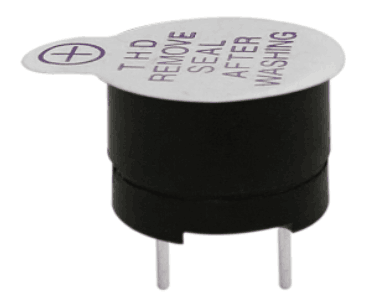  |
|   10    |            Passive Buzzer             |      1       |   |
|   11    |             Button Switch             |      4       | 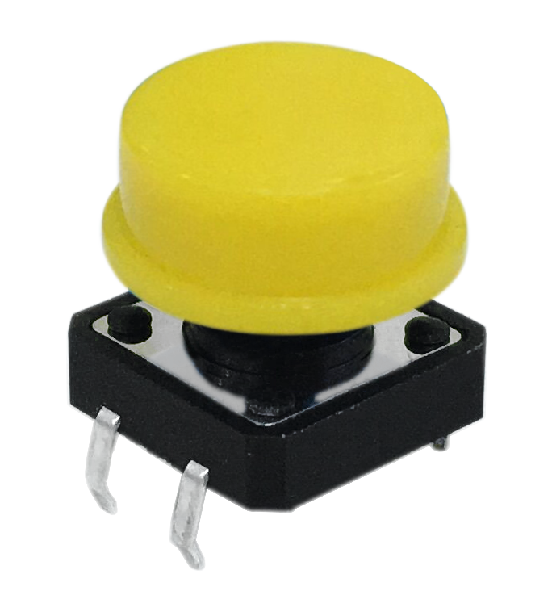  |
|   12    |           Ball Tilt Sensor            |      2       |   |
|   13    |            Photo Resistor             |      3       |   |
|   14    |             Flame Sensor              |      1       |   |
|   15    |           LM35 Temp Sensor            |      1       |   |
|   16    |          IC 74HC595N 16-pin           |      1       |   |
|   17    |   1-digit 7-seg LED Segment Display   |      1       |   |
|   18    |   4-digit 7-seg LED Segment Display   |      1       |   |
|   19    |            8\*8 LED Matrix            |      1       |   |
|   20    |           1602 LCD display            |      1       |  |
|   21    |              IR Receiver              |      1       |   |
|   22    |           IR Remote Control           |      1       |   |
|   23    |          Blue Micro Servo 9G          |      1       |   |
|   24    |             40Pin Headers             |      1       |   |
|   25    |          830-hole Breadboard          |      1       |   |
|   26    |              Jumper Wire              |      30      |   |
|   27    |        6-cell AA Battery Case         |      1       |   |
|   28    |               USB Cable               |      1       |   |
|   29    |              L293D chip               |      1       |   |
|   30    |             Relay Module              |      1       |   |
|   31    |           PIR Motion Sensor           |      1       |   |
|   32    |       HC-SR04 Ultrasonic Sensor       |      1       |   |
|   33    | DHT11 Temperature and Humidity Sensor |      1       |   |
|   34    |                 Motor                 |      1       |   |
|   35    |               Motor fan               |      1       |   |

## 3. Install Arduino IDE and Driver

**Installing Arduino IDE**

When we get control board, we need to download Arduino IDE and driver firstly.

You could download Arduino IDE from the official website [https//www.arduino.cc/](https://www.arduino.cc/), click the **SOFTWARE** on the browse bar, click “DOWNLOADS” to enter download page, as shown below


There are various versions Of IDE for Arduino, just download a version that compatible with your system, here we will show you how to download and install the windows version Arduino IDE.


There are two versions of IDE for WINDOWS system, you can choose between the Installer (.exe) and the Zip packages. We suggest you use the first one that installs directly everything you need to use the Arduino Software (IDE), including the drivers. With the Zip package you need to install the drivers manually. The Zip file is also useful if you want to create a portable installation.


You just need to click JUST DOWNLOAD.

**Keyestudio V4.0 Development Board**

We need to know keyestudio V4.0 development board, as a core of this kit.


keyestudio V4.0 development board is an Arduino board, which is based on ATmega328P MCU, and with a cp2102 Chip as a UART-to-USB converter.


It has 14 digital input/output pins (of which 6 can be used as PWM outputs), 6 analog inputs, a 16 MHz quartz crystal, a USB connection, a power jack, 2 ICSP headers and a reset button.


It contains everything needed to support the microcontroller; simply connect it to a computer with a USB cable or power it via an external DC power jack (DC 7-12V) or via female headers Vin/ GND(DC 7-12V) to get started.

| Microcontroller             | ATmega328P-PU                                            |
|-----------------------------|----------------------------------------------------------|
| Operating Voltage           | 5V                                                       |
| Input Voltage (recommended) | DC7-12V                                                  |
| Digital I/O Pins            | 14 (D0-D13) (of which 6 provide PWM output)              |
| PWM Digital I/O Pins        | 6 (D3, D5, D6, D9, D10, D11)                             |
| Analog Input Pins           | 6 (A0-A5)                                                |
| DC Current per I/O Pin      | 20 mA                                                    |
| DC Current for 3.3V Pin     | 50 mA                                                    |
| Flash Memory                | 32 KB (ATmega328P-PU) of which 0.5 KB used by bootloader |
| SRAM                        | 2 KB (ATmega328P-PU)                                     |
| EEPROM                      | 1 KB (ATmega328P-PU)                                     |
| Clock Speed                 | 16 MHz                                                   |
| LED_BUILTIN                 | D13                                                      |

**Keyestudio MEGA 2560 Board**

Keyestudio Mega 2560 R3 is a microV4.0 Board or MEGA 2650 Board based on the ATMEGA2560-16AU , fully compatible with ARDUINO MEGA 2560 R3.


It has 54 digital input/output pins (of which 15 can be used as PWM outputs), 16 analog inputs, 4 UARTs (hardware serial ports), a 16 MHz crystal oscillator, a USB connection, a power jack, 1 ICSP header, and a reset button. The built-in ICSP port can burn the firmware for ATMEGA2560-16AU directly. This chip is burnt the firmware well before leaving the factory, therefore, we hardly use it. We can power on by USB wire, DC head and Vin GND pins. To facilitate wiring, a 0.5m USB wire is provided for you.


**Functions of Pins:**

1\. Serial Communication: D0 (RX0) and D1 (TX1); Serial 1: D19 (RX1) and D18 (TX1); Serial 2: D17 (RX2) and D16 (TX2); Serial 3: D15 (RX3) and D14 (TX3). Used to receive (RX) and transmit (TX) TTL serial data. Pins 0 and 1 are also connected to the corresponding pins of the CP2102 USB-to-TTL Serial chip.

2\. PWM Pins (Pulse-Width Modulation): D2 to D13, and D44 to D46. Provide 8-bit PWM output with the analogWrite() function.

3\. External Interrupts: D2 (interrupt 0), D3 (interrupt 1), D18 (interrupt 5), D19 (interrupt 4), D20 (interrupt 3), and D21 (interrupt 2). These pins can be configured to trigger an interrupt on a low level, a rising or falling edge, or a change in level. See the attachInterrupt() function for details.

4\. SPI communication: D53 (SS), D52 (SCK), D51 (MOSI), D50 (MISO). These pins support SPI communication using theSPI library. The SPI pins are also broken out on the ICSP header, which is physically compatible with the Arduino Uno.

5\. IIC communication: D20 (SDA); D21 (SCL). Support TWI communication using the Wire library.

**Installing V4.0 board Driver**

Let’s install the driver of keyestudio V4.0 board. The USB-TTL chip on V4.0 board adopts CP2102 serial chip. The driver program of this chip is included in Arduino 1.8 version and above, which is convenient. Plug on USB port of board, the computer can recognize the hardware and automatically install the driver of CP2102.

If install unsuccessfully, or you intend to install manually, open the device manager of computer. Click **Computer----- Properties----- Device Manager**.


There is a yellow exclamation mark on the page, which implies installing unsuccessfully. Then we double click the hardware and update the driver.


Click“OK”to enter the following page, click“browse my computer for updated driver software”, find out the installed or downloaded ARDUINO software. As shown below


There is a DRIVERS folder in Arduino software installed package（）, open driver folder and you can see the driver of CP210X series chips.

We click “Browse”, then find out the driver folder, or you could enter “driver” to search in rectangular box, then click “next”, the driver will be installed successfully. (I place Arduino software folder on the desktop, you could follow my way)


Open device manager, we will find the yellow exclamation mark disappear. The driver of CP2102 is installed successfully.


**The installation method of keyestudio MEGA 2560 board and V4.0 board is same**.

**Arduino IDE Setting**

Clickicon，open Arduino IDE.


To avoid the errors when uploading the program to the board, you need to select the correct V4.0 Board or MEGA 2650 Board that matches the board connected to your computer.

Then come back to the Arduino software, you should click Tools→Board, select the board. (as shown below)


Then select the correct COM port (you can see the corresponding COM port after the driver is successfully installed).


Before uploading the program to the board, let’s demonstrate the function of each symbol in the Arduino IDE toolbar.


A- Used to verify whether there is any compiling mistakes or not. 
B- Used to upload the sketch to yourV4.0 Board or MEGA 2650 Board\*1 . 
C- Used to create shortcut window of a new sketch. 
D- Used to directly open an example sketch. 
E- Used to save the sketch. 
F- Used to send the serial data received from board to the serial monitor.

**Start First Program**

Open the file to select Example, choose BLINK from BASIC, as shown below.


Set board and COM port, the corresponding board and COM port are shown on the lower right of IDE.


Clickto start compiling the program, check errors.


Clickto upload the program, upload successfully.


Upload the program successfully, the onboard LED lights on for 1s, lights off for 1s. Congratulation, you finish the first program.

**If it is keyestudio MEGA 2560 board, please select Arduino MEGA or MEGA 2560 board**


## 4. How to Add a Library?

What are Libraries ?

[Libraries](https://www.arduino.cc/en/Reference/Libraries) are a collection of code that makes it easy for you to connect to a sensor,display, module, etc.

For example, the built-in LiquidCrystal library helps talk to LCD displays. There are hundreds of additional libraries available on the Internet for download.

The built-in libraries and some of these additional libraries are listed in the reference.

How to Install a Library ?

Here we will introduce the most simple way for you to add libraries . 

**Step 1**

After downloading well the Arduino IDE, you can right-click the icon of Arduino IDE.  Find the option "Open file location" shown as below.

[](http://wiki.keyestudio.com/index.php/File:Libraries_1.png)

**Step 2 **

Enter it to find out libraries folder, this folder is the library file of Arduino.

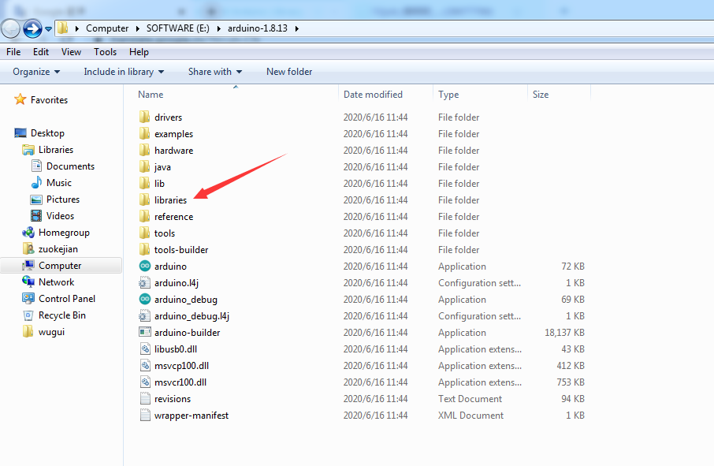

**Step 3 **

Next to find out the “libraries” folder of this kit(seen in the link [https//fs.keyestudio.com/KS0402-0404](https//fs.keyestudio.com/KS0402-0404)）.


You just need to replicate and paste above libraries into the libraries folder of Arduino IDE.

Then the libraries of this kit are installed successfully, as shown below  


**Note the Arduino software download and the driver installation of keyetudio Mega 2560 R3 board is similar to arduino V4.0 board.**

## 5.Projects

Project 1: Hello World

**1）Introduction**

As for starters, we will begin with something simple. In this project, you only need an Arduino and a USB cable to start the "Hello World!" experiment.

This is a communication test of your Arduino and PC, also a primer project for you to have your first try of the Arduino world!

**2）Hardware required**

- V4.0 Board or MEGA 2650 Board x1
- USB cable x1

**3）Sample program**

After installing driver for Arduino, let's open Arduino software and compile code that enables Arduino to print "Hello World!" under your instruction.

Of course, you can compile code for Arduino to continuously echo "Hello World!" without instruction.

A simple If () statement will do the instruction trick. With the onboard LED connected to pin 13, we can instruct the LED to blink first when Arduino gets an instruction and then prints "Hello World!”.

```c

int val;//define variable val

int ledpin=13;// define digital interface 13

void setup()

{

 Serial.begin(9600);// set the baud rate at 9600 to match the software set up. When connected to a specific device, (e.g. bluetooth), the baud rate needs to be the same with it.

 pinMode(ledpin,OUTPUT);// initialize digital pin 13 as output. When using I/O ports on an Arduino, this kind of set up is always needed.

}

void loop()

{

 val=Serial.read();// read the instruction or character from PC to Arduino, and assign them to Val.

 if(val=='R')// determine if the instruction or character received is “R”.

 {  // if it’s “R”,   

  digitalWrite(ledpin,HIGH);// set the LED on digital pin 13 on. 

  delay(500);

 digitalWrite(ledpin,LOW);// set the LED on digital pin 13 off.   delay(500);

 

  Serial.println("Hello World!");// display“Hello World！”string.

 }

}

```


**4）Result Show**


Done compiling and uploading the code, click to open serial port monitor and set the baud rate to 9600.

Enter an “R” and click Send. LED 13 will blink once, and your PC will receive information from Arduino: Hello World.


Now, the experiment is complete, so easy! What if upload failed? Check whether you select the correct Board and Port in Tools.


Project 2: LED blinking

**1）Introduction**

Blinking LED experiment is quite simple. In the "Hello World!" program, we have come across LED. This time, we are going to connect an LED to one of the digital pins rather than using the built-in LED13 of V4.0 Board or MEGA 2650 Board. Except an Arduino and an USB cable, we will need extra parts below.

**2）Hardware required**

- V4.0 Board or MEGA 2650 Board \*1

- Red M5 LED\*1

- 220Ω resistor\*1

- Breadboard\*1

- USB cable \*1

- Jumper wire\* 2


We follow the connection diagram below to connect the components.

Here we use digital pin 10. We connect LED to a 220ohm resistor to avoid high current damaging the LED.

**3）Connection**

**For V4.0**


**For 2560 R3**


**4）Sample program**

```c
int ledPin = 10; // define digital pin 10.
void setup()
{
pinMode(ledPin, OUTPUT);// define pin with LED connected as output.
}
void loop()
{
digitalWrite(ledPin, HIGH); // set the LED on.
delay(1000); // wait for a second.
digitalWrite(ledPin, LOW); // set the LED off.
delay(1000); // wait for a second
}
```


**5）Test Result**

After downloading this program, in the experiment, you will see the LED connected to pin 10 turning on and off, with an interval approximately one second.

The blinking LED experiment is now completed. Thank you!


Project 3: PWM

**1）Introduction**

PWM, short for Pulse Width Modulation, is a technique used to encode analog signal level into digital ones.

A computer cannot output analog voltage but only digital voltage values such as 0V or 5V. So we use a high resolution counter to encode a specific analog signal level by modulating the duty cycle of PMW.

The PWM signal is also digitalized because in any given moment, fully on DC power supply is either 5V (ON), or 0V (OFF). The voltage or current is fed to the analog load (the device that uses the power) by repeated pulse sequence being ON or OFF. Being on, the current is fed to the load; being off, it's not.

With adequate bandwidth, any analog value can be encoded using PWM. The output voltage value is calculated via the on and off time.

Output voltage = (turn on time/pulse time) \* maximum voltage value


PWM has many applications: lamp brightness regulating, motor speed regulating, sound making, etc.

**The following are the three basic parameters of PMW:**

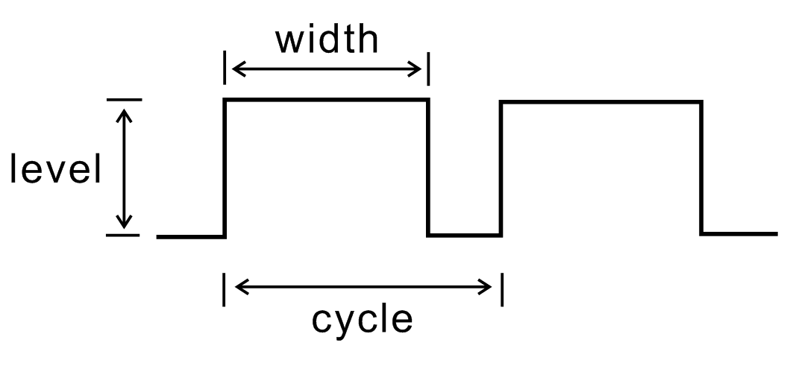

1\. The amplitude of pulse width (minimum / maximum)

2\. The pulse period (The reciprocal of pulse frequency in 1 second)

3\. The voltage level (such as 0V-5V )

There are 6 PMW pins onV4.0 Board or MEGA 2650 Board\*1 , namely digital pin 3,5, 6, 9, 10, and 11.

In previous experiments, we have done "button-controlled LED", using digital signal to control digital pin.

This time, we will use a potentiometer to control the brightness of LED.


**2）Hardware required**

- V4.0 Board or MEGA 2650 Board \*1

- Potentiometer \*1

- Red M5 LED \*1

- 220Ω resistor \*1

- Breadboard \*1

- USB cable \*1

- Breadboard jumper wire \* 6

The input of potentiometer is analog, so we connect it to analog port, and LED to PWM port. Different PWM signal can regulate the brightness of the LED.

**3）Connection**

**For V4.0**


**For 2560 R3**


**4）Sample program**

In the program compiling process, we will use the **analogWrite** (PWM interface, analog value) function.

In this experiment, we will read the analog value of the potentiometer and assign the value to PWM port, so there will be corresponding change to the brightness of the LED.

One final part will be displaying the analog value on the monitor window. You can consider this as the "analog value reading" project adding the PWM analog value assigning part.

Below is a sample program for your reference.

```c
int potpin=0;// initialize analog pin 0
int ledpin=11;//initialize digital pin 11（PWM output）
int val=0;// Temporarily store variables' value from the sensor
void setup()
{
pinMode(ledpin,OUTPUT);// define digital pin 11 as “output”
Serial.begin(9600);// set baud rate at 9600
// attention: for analog ports, they are automatically set up as “input”
}
void loop()
{

val=analogRead(potpin);// read the analog value from the sensor and assign it to val
Serial.println(val);// display value of val
analogWrite(ledpin,val/4);// turn on LED and set up brightness（maximum output of PWM is 255）
delay(10);// wait for 0.01 second
}
```


**5）Test Result**

After uploading the program to the board, rotate the potentiometer knob, you can see the changes of displaying value, and also obvious change of LED brightness.


Project 4: Traffic light

**1）Introduction**

In the previous program, we have done the LED blinking experiment with one LED. Now, it’s time to up the stakes and do a bit more complicated experiment-traffic lights. 

Actually, these two experiments are similar. While in this traffic lights experiment, we use 3 LEDs with different colors rather than 1 LED.

**2）Hardware required**

- V4.0 Board or MEGA 2650 Board\*1
- USB cable \*1

- Red M5 LED\*1

- Yellow M5 LED\*1

- Green M5 LED\*1

- 220Ω resistor \*3

- Breadboard\*1

- Breadboard jumper wires

**3）Connection**

**For V4.0**


**For 2560 R3**


**4）Sample program**

Since it is a simulation of traffic lights, the blinking time of each LED should be the same with those in traffic lights system.

In this program, we use Arduino **delay ()** function to control delay time, which is much simpler than C language.

```c
int redled =10; // initialize digital pin 8.
int yellowled =7; // initialize digital pin 7.
int greenled =4; // initialize digital pin 4.
void setup()
{
pinMode(redled, OUTPUT);// set the pin with red LED as “output”
pinMode(yellowled, OUTPUT); // set the pin with yellow LED as “output”
pinMode(greenled, OUTPUT); // set the pin with green LED as “output”
}
void loop()
{
digitalWrite(greenled, HIGH);//// turn on green LED
delay(5000);// wait 5 seconds

digitalWrite(greenled, LOW); // turn off green LED
for(int i=0;i<3;i++)// blinks for 3 times
{
delay(500);// wait 0.5 second
digitalWrite(yellowled, HIGH);// turn on yellow LED
delay(500);// wait 0.5 second
digitalWrite(yellowled, LOW);// turn off yellow LED
} 
delay(500);// wait 0.5 second
digitalWrite(redled, HIGH);// turn on red LED
delay(5000);// wait 5 seconds
digitalWrite(redled, LOW);// turn off red LED
}
```


**5）Test Result**

When the uploading process is completed, you can see your own traffic light design.

The green light will be on for 5 seconds, and then off., followed by the yellow light blinking for 3 times, and then the red light on for 5 seconds, forming a cycle. Cycle then repeats. Experiment is now completed, thank you.

**Note:** this circuit design is very similar with the following LED chasing effect.


Project 5: LED chasing effect


**1）Introduction**

We often see billboards composed of colorful LEDs. They are constantly changing to form various light effects. In this experiment, we compile a program to simulate LED chasing effect.

**2）Hardware required**

- Led \*6

- V4.0 Board or MEGA 2650 Board \*1

- 220Ω resistor \*6

- Breadboard \*1

- USB cable\*1

- Breadboard wire \*13

**3）Connection**

**For V4.0**


**For 2560 R3**


**4）Sample program**

```c
int BASE = 2 ;  // the I/O pin for the first LED
int NUM = 6;   // number of LEDs
void setup()
{
   for (int i = BASE; i < BASE + NUM; i ++) 
   {
     pinMode(i, OUTPUT);   // set I/O pins as output
   }
}
void loop()
{
   for (int i = BASE; i < BASE + NUM; i ++) 
   {
     digitalWrite(i, LOW);    // set I/O pins as “low”, turn off LEDs one by one.
     delay(200);        // delay
   }
   for (int i = BASE; i < BASE + NUM; i ++) 
   {
     digitalWrite(i, HIGH);    // set I/O pins as “high”, turn on LEDs one by one
     delay(200);        // delay
   }  
}
```


**5）Result**

You can see the LEDs blink by sequence.


Project 6: Button-controlled LED

**1）Introduction**

I/O port means interface for INPUT and OUTPUT. Up until now, we have only used the OUTPUT function.

In this experiment, we will try to use the input function, which is to read the output value of device. We use 1 button and 1 LED using both input and output to give you a better understanding of the I/O function.

Button switches, familiar to most of us, are a switch value (digital value) component. When it's pressed, the circuit is in closed (conducting) state.

2）Hardware required


- V4.0 Board or MEGA 2650 Board \*1

- Button switch \*1

- Red M5 LED \*1

- 220Ω resistor \*1

- 10KΩ resistor \*1

- Breadboard \*1

- USB cable \*1

- Breadboard jumper wire \* 6

**3）Connection**

**For V4.0**


**For 2560 R3**


**4）Sample program**

Now, let's begin the compiling. When the button is pressed, the LED will be on. After the previous study, the coding should be easy for you.

In this program, we add a statement of judgment. Here, we use an **if ()statement**.

Arduino IDE is based on C language, so statements of C language such as **while**, switch can certainly be used for Arduino program.

When we press the button, pin 7 will output high level. We can program pin 11 to output high level and turn on the LED.

When pin 7 outputs low level, pin 11 also outputs low level and the LED remains off.

```c
int ledpin=11;// initialize pin 11
int inpin=7;// initialize pin 7
int val;// define val
void setup()
{
pinMode(ledpin,OUTPUT);// set LED pin as “output”
pinMode(inpin,INPUT);// set button pin as “input”

}
void loop()
{
val=digitalRead(inpin);// read the level value of pin 7 and assign if to val
if(val==LOW)// check if the button is pressed, if yes, turn on the LED
{ digitalWrite(ledpin,LOW);}
else
{ digitalWrite(ledpin,HIGH);}
}
```

****

**5）Result**

When the button is pressed, LED is on; otherwise, LED remains off. Congrats! the button controlled LED experiment is completed.

The simple principle of this experiment is widely used in a variety of circuit and electric appliances. You can easily come across it in your every day life. One typical example is when you press a certain key of your phone, the backlight will be on.

Project 7: Active buzzer


**1）Introduction**

Active buzzer is a sound making element, widely used on computer, printer, alarm, electronic toy, telephone, timer, etc. It has an inner vibration source. Simply connect it with 5V power supply, it can buzz continuously.

**2）Hardware required**

- Buzzer \*1
- V4.0 Board or MEGA 2650 Board \*1
- Breadboard \*1
- USB cable \*1
- Breadboard jumper wires \* 2

**3）Connection**

**For V4.0**


**For 2560 R3**


When connecting the circuit, pay attention to the positive and negative poles of the buzzer. In the photo, you can see there are red and black lines. When the circuit is finished, you can begin programming.

**4）Sample program**

Program is simple. You control the buzzer by outputting high/low level.

```c
int buzzer=8;// initialize digital IO pin that controls the buzzer
void setup() 
{ 
  pinMode(buzzer,OUTPUT);// set pin mode as “output”
} 
void loop() 
{
digitalWrite(buzzer, HIGH); // produce sound
}
```


**5）Result**

After downloading the program, the buzzer experiment is completed. You can hear the buzzer is ringing.


Project 8: Passive buzzer


**1）Introduction**

We can use Arduino to make many interactive works of which the most commonly used is acoustic-optic display.

All the previous experiment has something to do with LED. However, the circuit in this experiment can produce sound. Normally, the experiment is done with a buzzer or a speaker while buzzer is more simpler and easier to use.

The buzzer we introduced here is a passive buzzer. It cannot be actuated by itself, but by external pulse frequencies. Different frequencies produce different sounds. We can use Arduino to code the melody of a song, which is quite fun and simple.


**2）Hardware required**

-   Passive buzzer\*1

-   V4.0 Board or MEGA 2650 Board \*1

-   Breadboard\*1

-   USB cable \*1

-   Breadboard jumper wire \* 2

**3）Connection**

**For V4.0**

Here we connect the passive buzzer to digital pin 8.


**For 2560 R3**


**4）Sample program**

```c
int buzzer=8;// select digital IO pin for the buzzer
void setup() 
{ 
pinMode(buzzer,OUTPUT);// set digital IO pin pattern, OUTPUT to be output 
} 
void loop() 
{ unsigned char i,j;//define variable
while(1) 
{ for(i=0;i<80;i++)// output a frequency sound
{ digitalWrite(buzzer,HIGH);// sound
delay(1);//delay1ms 
digitalWrite(buzzer,LOW);//not sound

delay(1);//ms delay 
} 

for(i=0;i<100;i++)// output a frequency sound
{ 
digitalWrite(buzzer,HIGH);// sound
digitalWrite(buzzer,LOW);//not sound
delay(2);//2ms delay 
}
} 
} 
```


**5）Result**

After downloading the program, buzzer experiment is finished. You can hear the buzzer beep.


Project 9: RGB LED

****

**1）Introduction**

Tricolor principle to display various colors; PWM controlling ports to display full color; It can be driven directly by Arduino PWM interfaces.


**2）Hardware required**

- V4.0 Board or MEGA 2650 Board × 1

- Full-color RGB LED × 1

- Resistor x 3

- Breadboard x 1

- USB cable x 1

- Jumper wire x 5

**3）Connection**

**For V4.0**


**For 2560 R3**

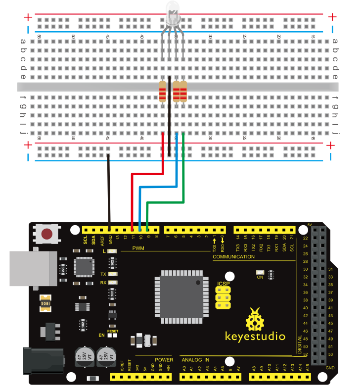

**4）Sample Program**

```c
int redpin = 11; //select the pin for the red LED
int bluepin =10; // select the pin for the blue LED
int greenpin =9;// select the pin for the green LED

int val;

void setup() {
  pinMode(redpin, OUTPUT);
  pinMode(bluepin, OUTPUT);
  pinMode(greenpin, OUTPUT);
  Serial.begin(9600);
}

void loop() 
{
for(val=255; val>0; val--)
  {
   analogWrite(11, val);
   analogWrite(10, 255-val);
   analogWrite(9, 128-val);
   delay(1); 
  }
for(val=0; val<255; val++)
  {
   analogWrite(11, val);
   analogWrite(10, 255-val);
   analogWrite(9, 128-val);
   delay(1); 
  }
 Serial.println(val, DEC);
}
```


**5）Result**

Directly copy the above code into arduino IDE, and click upload, wait for a few seconds, you can see a full-color RGB LED flash.


Project 10: Photo Resistor

****

**1）Introduction**

After completing all the previous experiments, we acquired some basic understanding and knowledge about Arduino application. We have learned digital input and output, analog input and PWM. Now, we can begin the learning of sensors applications.

Photo-Resistor (Photovaristor) is a resistor whose resistance varies according to different incident light strength.

It's made based on the photoelectric effect of semiconductor. If the incident light is intense, its resistance reduces; if the incident light is weak, the resistance increases.

Photovaristor is commonly applied in the measurement of light, light control and photovoltaic conversion (convert the change of light into the change of electricity).

Photo resistor is also being widely applied to various light control circuits, such as light control and adjustment, optical switches, etc.

We will start with a relatively simple experiment regarding photovaristor application.

Photovaristor is an element that changes its resistance as light strength changes. So we will need to read the analog values. We can refer to the PWM experiment, replacing the potentiometer with photovaristor. When there is change in light strength, there will be corresponding change on the LED.

**2）Hardware Required**

- Photo-resistor sensor \*1

- V4.0 Board or MEGA 2650 Board\*1

- Red M5 LED \*1

- 10KΩ resistor \*1

- 220Ω resistor \*1

- Breadboard \*1

- USB cable \*1

- Breadboard jumper wire \* 5

**3）Connection**

**For V4.0**


**For 2560 R3**


**4）Sample program**

After the connection, let's begin the program compiling. The program is similar to the one of PWM. For change detail, please refer to the sample program below.

```c
int potpin=0;// initialize analog pin 0, connected with photovaristor
int ledpin=11;// initialize digital pin 11, output regulating the brightness of LED
int val=0;// initialize variable val
void setup()
{
pinMode(ledpin,OUTPUT);// set digital pin 11 as “output”
Serial.begin(9600);// set baud rate at “9600”
}
void loop()
{
val=analogRead(potpin);// read the analog value of the sensor and assign it to val
Serial.println(val);// display the value of val
analogWrite(ledpin,val);// turn on the LED and set up brightness（maximum output value 255）
delay(10);// wait for 0.01 
}
```


**5）Result**

After downloading the program, you can change the light strength around the photovaristor and see corresponding brightness change of the LED.

Photovaristors has various applications in our everyday life. You can make other interesting interactive projects base on this one.


Project 11: Flame sensor

**1）Introduction**

Flame sensor (Infrared receiving triode) is specially used on robots to find the fire source. This sensor is of high sensitivity to flame. Below is a photo of it.


**2）Working principle**

Flame sensor is made based on the principle that infrared ray is highly sensitive to flame. It has a specially designed infrared receiving tube to detect fire, and then convert the flame brightness into fluctuating level signal. The signals are then input into the central processor and be dealt with accordingly.

**3）Sensor connection**

The shorter lead of the receiving triode is for negative, the other one for positive. Connect negative to 5V pin, positive to resistor; connect the other end of the resistor to GND, connect one end of a jumper wire to a clip which is electrically connected to sensor positive, the other end to analog pin. As shown below:

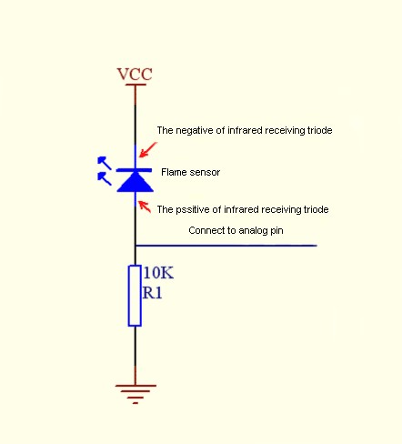

**4）Hardware required**

- Flame sensor \*1

- V4.0 Board or MEGA 2650 Board\*1

- Buzzer \*1

- 10K resistor \*1

- USB cable \*1

- Breadboard jumper wire \* 6

**5）Connection**

**For V4.0**

**Connecting buzzer:**

Connect the buzzer to digital pin 8.

**Connecting flame sensor:**

Connect the flame sensor to analog pin 0.


**For 2560 R3**


**Experiment principle**

When it's approaching a fire, the voltage value read from the analog port differs.

If you use a multimeter, you can know when there is no fire approaching, the voltage it reads is around 0.3V; when there is fire approaching, the voltage it reads is around 1.0V. The nearer the fire, the higher the voltage is.

So in the beginning of the program, you can initialize voltage value **i** (no fire value); Then, continuously read the analog voltage value **j** and obtain difference value **k=j-i**; compare **k** with 0.6V (123 in binary) to determine whether there is a fire approaching or not; if yes, the buzzer will buzz.

**6）Sample program**

```c
int flame=0;// select analog pin 0 for the sensor
int Beep=9;// select digital pin 9 for the buzzer
int val=0;// initialize variable
 void setup() 
{
 pinMode(Beep,OUTPUT);// set LED pin as “output”
 pinMode(flame,INPUT);// set buzzer pin as “input”
 Serial.begin(9600);// set baud rate at “9600”
 } 
void loop() 
{ 
  val=analogRead(flame);// read the analog value of the sensor 
  Serial.println(val);// output and display the analog value
  if(val>=600)// when the analog value is larger than 600, the buzzer will buzz
  {  
   digitalWrite(Beep,HIGH); 
   }else 
   {  
     digitalWrite(Beep,LOW); 
    }
   delay(500); 
}
```


**7）Result**

This program can simulate an alarm when there is a fire.

Everything is normal when there is no fire; but when there is a fire, the alarm will be set off immediately.


Project 12: LM35 temperature sensor


**1）Introduction**

LM35 is a common and easy-to-use temperature sensor. It does not require other hardware. You just need an analog port to make it work. The difficulty lies in compiling the code to convert the analog value it reads into Celsius temperature.


**2）Hardware required**

- LM35\*1

- V4.0 or MEGA 2650 Board\*1

- Breadboard\*1

- USB cable \*1

- Breadboard jumper wire \*5

**3）Connection**

**For V4.0**


**For 2560 R3**


**4）Sample program**

```c
int potPin = 0; // initialize analog pin 0 for LM35 temperature sensor
void setup()
{
Serial.begin(9600);// set baud rate at”9600”
}
void loop()
{
int val;// define variable
int dat;// define variable
val=analogRead(0);// read the analog value of the sensor and assign it to val
dat=(125*val)>>8;// temperature calculation formula
Serial.print("Tep:");// output and display characters beginning with Tep
Serial.print(dat);// output and display value of dat
Serial.println("C");// display “C” characters
delay(500);// wait for 0.5 second
}
```


**5）Result**

After downloading the program, you can open the monitoring window to see current temperature.


Project 13: Ball tilt switch

****

**1）Introduction**

This lesson let’s use a ball tilt switch to control the ON and OFF of LED

**2）Hardware required**

- Ball switch\*1

- V4.0 Board or MEGA 2650 Board\*1

- Led \*1

- 220Ω resistor\*1

- 10KΩ resistor\*1

- USB cable \*1

- Breadboard jumper wire \*5

**3）Connection**

**For V4.0**

Connect the ball tilt switch, LED and resistors to control board. Connect the LED to digital pin 8, ball switch to analog pin 5.


**For 2560 R3**


**Experiment principle**

When one end of the switch is below horizontal position, the switch is on. The voltage of the analog port is about 5V (1023 in binary). The LED will be on.

When the other end of the switch is below horizontal position, the switch is off. The voltage of the analog port is about 0V (0 in binary). The LED will be off.

In the program, we determine whether the switch is on or off according to the voltage value of the analog port, whether it's above 2.5V (512 in binary) or not.

**4）Sample program**

```c
void setup() 
{ 
  pinMode(8,OUTPUT);// set digital pin 8 as “output” 
} 
void loop() 
{ 
int i;// define variable i 

while(1) 
{ 
  i=analogRead(5);// read the voltage value of analog pin 5 
  if(i>512)// if larger that 512（2.5V） 
  { 
    digitalWrite(8,LOW);// turn on LED 
  } 
  else// otherwise 
  { 
    digitalWrite(8,HIGH);// turn off LED 
  } 
 } 
}
```


**5）Test Result**

Hold the breadboard with your hand. Tilt it to a certain angle, so the tiny ball inside tilt switch is conducted, the LED will be on.

If there is no tilt, the LED will be off.

The principle of this experiment can also be applied to relay control. Experiment completed. Thank you!


Project 14: IR remote control


**1）Infrared receiver**

The signal from the infrared remote controller is a series of binary pulse code. To avoid interference from other infrared signals during the wireless transmission, the signal is pre-modulate at a specific carrier frequency and then send out by a infrared emission diode.

The infrared receiving device needs to filter out other wave and receives signal at that specific frequency and modulates it back to binary pulse code, known as demodulation.

**Working principal:**

The built-in receiver converts the light signal it received from the sender into feeble electrical signal. The signal will be amplified by the IC amplifier.

After automatic gain control, band-pass filtering, demodulation, wave shaping, it returns to the original code. The code is then input to the code identification circuit by the receiver's signal output pin.

**Pins and wiring of infrared receiver:**


Infrared receiver has 3 pins. When you use it, connect VOUT to analog pin, GND to GND, VCC to +5V.

Next, let’s move on to an infrared remote control experiment.

**2）Hardware required**

-   V4.0 Board or MEGA 2650 Board\*1

-   Infrared remote controller x1

-   Infrared receiver x1

-   LED x6

-   220Ω resistor x6

-   Breadboard wire x 10

**3）Connection Diagram**

First, connect the V4.0 Board or MEGA 2650 Board; then connect the infrared receiver as the above mentioned, connect VOUT to digital pin 11.

Then connect one end of each LED connected with a resistor to cathode row; the other end of each LED to pin 2, 3, 4, 5, 6, 7.

**Connection for V4.0:**


**Connection for 2560 R3:**

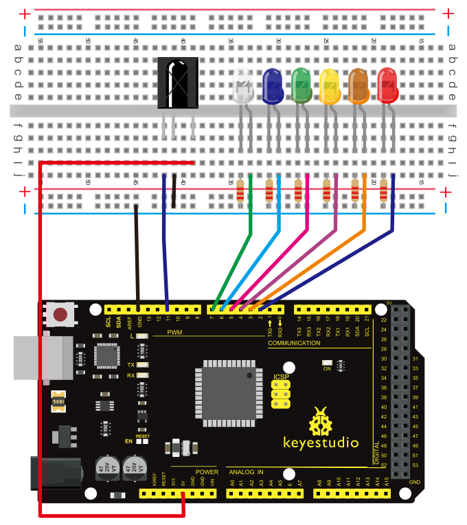

**Experimental principle**

If you want to decode a remote controller, you must first know how it's coded. The coding method we use here is NEC protocol. Below is a brief introduction.

**·NEC protocol:**

**4）Features**

(1) 8 bit address and 8 bit command length 
(2) address and command are transmitted twice for reliability 
(3) pulse distance modulation 
(4) carrier frequency of 38 KHZ 
(5) bit time of 1.125ms or 2.25ms

**Protocol is as below:**

**• Definition of logical 0 and 1 is as below**


**• Pulse transmitted when button is pressed and immediately released**


The picture above shows a typical pulse train of the NEC protocol. With this protocol the LSB is transmitted first. In this case Address \$59 and Command $16 is transmitted. A message is started by a 9ms AGC burst, which was used to set the gain of the earlier IR receivers.

This AGC burst is then followed by a 4.5ms space, which is then followed by the address and command. Address and Command are transmitted twice. The second time all bits are inverted and can be used for verification of the received message. 

The total transmission time is constant because every bit is repeated with its inverted length.

If you are not interested in this reliability, you can ignore the inverted values, or you can expend the Address and Command to 16 bits each!

**• Pulse transmitted when button is pressed and released after a period of time**


A command is transmitted only once, even when the key on the remote control remains pressed. Every 110ms a repeat code is transmitted for as long as the key remains down. This repeat code is simply a 9ms AGC pulse followed by a 2.25ms space and a 560µs burst.

**·Repeat pulse**


**Note:** when the pulse enters the integrated receiver, there will be decoding, signal amplifying and wave shaping process.

So you need to make sure the level of the output is just the opposite from that of the signal sending end. That is when there is no infrared signal, the output end is in high level; when there is infrared signal, the output end is in low level.

You can see the pulse of the receiving end in the oscilloscope. Try to better understand the program base on what you see.

**5）Sample program**

**Note:** add **IRremote** folder into installation directory\Arduino\\compiler libraries, or else the code will not be able to compile.

For example：C:\\Program Files\\Arduino\\libraries

```c
#include <IRremote.h>
int RECV_PIN = 11;
int LED1 = 2;
int LED2 = 3;
int LED3 = 4;
int LED4 = 5;
int LED5 = 6;
int LED6 = 7;
long on1  = 0x00FFA25D;
long off1 = 0x00FFE01F;
long on2 = 0x00FF629D;
long off2 = 0x00FFA857;
long on3 = 0x00FFE21D;
long off3 = 0x00FF906F;
long on4 = 0x00FF22DD;
long off4 = 0x00FF6897;
long on5 = 0x00FF02FD;
long off5 = 0x00FF9867;
long on6 = 0x00FFC23D;
long off6 = 0x00FFB047;
IRrecv irrecv(RECV_PIN);
decode_results results;
// Dumps out the decode_results structure.
// Call this after IRrecv::decode()
// void * to work around compiler issue
//void dump(void *v) {
//  decode_results *results = (decode_results *)v
void dump(decode_results *results) {
  int count = results->rawlen;
  if (results->decode_type == UNKNOWN) 
    {
     Serial.println("Could not decode message");

    } 
  else 
   {
    if (results->decode_type == NEC) 
      {
       Serial.print("Decoded NEC: ");
      } 
    else if (results->decode_type == SONY) 
      {
       Serial.print("Decoded SONY: ");
      } 
    else if (results->decode_type == RC5) 
      {
       Serial.print("Decoded RC5: ");
      } 
    else if (results->decode_type == RC6) 
      {
       Serial.print("Decoded RC6: ");
      }
     Serial.print(results->value, HEX);
     Serial.print(" (");
     Serial.print(results->bits, DEC);
     Serial.println(" bits)");
   }
     Serial.print("Raw (");
     Serial.print(count, DEC);
     Serial.print("): ");

  for (int i = 0; i < count; i++) 
     {
      if ((i % 2) == 1) {
      Serial.print(results->rawbuf[i]*USECPERTICK, DEC);
     } 
    else  
     {
      Serial.print(-(int)results->rawbuf[i]*USECPERTICK, DEC);
     }
    Serial.print(" ");
     }
      Serial.println("");

     }

void setup()
 {
  pinMode(RECV_PIN, INPUT);   
  pinMode(LED1, OUTPUT);
  pinMode(LED2, OUTPUT);
  pinMode(LED3, OUTPUT);
  pinMode(LED4, OUTPUT);
  pinMode(LED5, OUTPUT);
  pinMode(LED6, OUTPUT);  
  pinMode(13, OUTPUT);
  Serial.begin(9600);
   irrecv.enableIRIn(); // Start the receiver
 }

int on = 0;
unsigned long last = millis();

void loop() 
{
  if (irrecv.decode(&results)) 
   {
    // If it's been at least 1/4 second since the last
    // IR received, toggle the relay
    if (millis() - last > 250) 
      {
       on = !on;
//       digitalWrite(8, on ? HIGH : LOW);
       digitalWrite(13, on ? HIGH : LOW);
       dump(&results);
      }
    if (results.value == on1 )
       digitalWrite(LED1, HIGH);
    if (results.value == off1 )
       digitalWrite(LED1, LOW); 
    if (results.value == on2 )
       digitalWrite(LED2, HIGH);
    if (results.value == off2 )
       digitalWrite(LED2, LOW); 

    if (results.value == on3 )
       digitalWrite(LED3, HIGH);
    if (results.value == off3 )
       digitalWrite(LED3, LOW);
    if (results.value == on4 )
       digitalWrite(LED4, HIGH);
    if (results.value == off4 )
       digitalWrite(LED4, LOW); 
    if (results.value == on5 )
       digitalWrite(LED5, HIGH);
    if (results.value == off5 )
       digitalWrite(LED5, LOW); 
    if (results.value == on6 )
       digitalWrite(LED6, HIGH);
    if (results.value == off6 )
       digitalWrite(LED6, LOW);        
    last = millis();      
    irrecv.resume(); // Receive the next value
  }}
```


**Program function**

Decode the coded pulse signal emitted by the remote controller; execute corresponding action according to the results of the decoding. In this way, you will be able to control your device with remote controller.

**6）Result**


Project 15: Analog value reading

**1）Introduction**

In this experiment, we will begin the learning of analog I/O interfaces. On an Arduino, there are 6 analog interfaces numbered from 0 to 5. These 6 interfaces can also be used as digital ones numbered as 14-19.

After a brief introduction, let's begin our project. Potentiometer used here is a typical output component of analog value that is familiar to us.


**2）Hardware required**

-   V4.0 Board or MEGA 2650 Board\*1

-   Potentiometer \*1

-   V4.0 Board or MEGA 2650 Board \*1

-   Breadboard\*1

-   USB cable \*1

-   Breadboard jumper wire \* 3

**3）Circuit connection**

In this experiment, we will convert the resistance value of the potentiometer to analog ones, and display the analog value on the screen.

This is an application we need to master well for our future experiments. Connection circuit as below:

**Connection for V4.0:**


The analog interface we use here is interface 0.

**Connection for 2560 R3:**

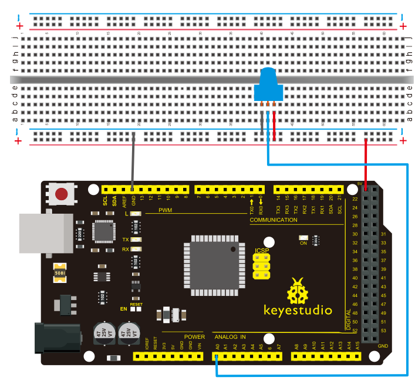

**4）Sample program**

The program compiling is simple. An **analogRead ()** Statement can read the value of the interface. The A/D acquisition of Arduino 328 is in 10 bits, so the value it reads is among 0 to 1023.

One difficulty in this project is to display the value on the screen, which is actually easy to learn.

First, we need to set the baud rate in **voidsetup ()**. Displaying the value is a communication between Arduino and PC, so the baud rate of the Arduino should match the one in the PC's software setup. Otherwise, the display will be messy codes or no display at all.

In the lower right corner of the Arduino software monitor window, there is a button for baud rate set up. The setup here needs to match the one in the program.

The statement in the program is **Serial.begin()**; enclosed is the baud rate value, followed by statement for displaying. You can either use **Serial.print()** or **Serial.println()** statement.

**Refer to the code below:**

```c
int potpin=0;// initialize analog pin 0
int ledpin=13;// initialize digital pin 13
int val=0;// define val, assign initial value 0
void setup()
{
pinMode(ledpin,OUTPUT);// set digital pin as “output”
Serial.begin(9600);// set baud rate at 9600

}
void loop()
{
digitalWrite(ledpin,HIGH);// turn on the LED on pin 13
delay(50);// wait for 0.05 second
digitalWrite(ledpin,LOW);// turn off the LED on pin 13
delay(50);// wait for 0.05 second
val=analogRead(potpin);// read the analog value of analog pin 0, and assign it to val 
Serial.println(val);// display val’s value
}
```


**5）Result**

The sample program uses the built-in LED connected to pin 13. Each time the device reads a value, the LED blinks once. Below is the analog value it reads.


When you rotate the potentiometer knob, you can see the displayed value change.

The reading of analog value is a very common function since most sensors output analog value. After calculation, we can have the corresponding value we need. The experiment is now complete. Thank you.

Project 16: 74HC595


**1）Introduction**

To put it simply, 74HC595 is a combination of 8-digit shifting register, memorizer and equipped with tri-state output. Here, we use it to control 8 LEDs.

You may wonder why use a 74HC595 to control LED? Well, think about how many I/O, it takes for an Arduino to control 8 LEDs? Yes, 8.

For an Arduino, it has only 20 I/O including analog ports. So, to save port resources, we use 74HC595 to reduce the number of ports it needs. Using 74HC595 enables us to use 3 digital I/O port to control 8 LEDs!

The 74HC595 devices contain an 8-bit serial-in, parallel-out shift register that feeds an 8-bit D-type storage register. The storage register has parallel 3-state outputs. Separate clocks are provided for both the shift and storage register.

The shift register has a direct overriding clear (SRCLR) input, serial (SER) input, and serial outputs for cascading. When the output-enable (OE) input is high, the outputs are in the high-impedance state. Both the shift register clock (SRCLK) and storage register clock (RCLK) are positive-edge triggered. If both clocks are connected together, the shift register always is one clock pulse ahead of the storage register.

**2）Hardware required**

-   74HC595 chip\*1

-   V4.0 Board or MEGA 2650 Board \*1

-   Red M5 LED\*4

-   Green M5 LED\*4

-   220Ω resistor\*8

-   Breadboard\*1

-   USB cable \*1

-   Breadboard jumper wires\*several

**3）Circuit Connection**

**Note:** for pin 13 OE port of 74HC595, it needs to connect to GND.

**Connection for V4.0:**

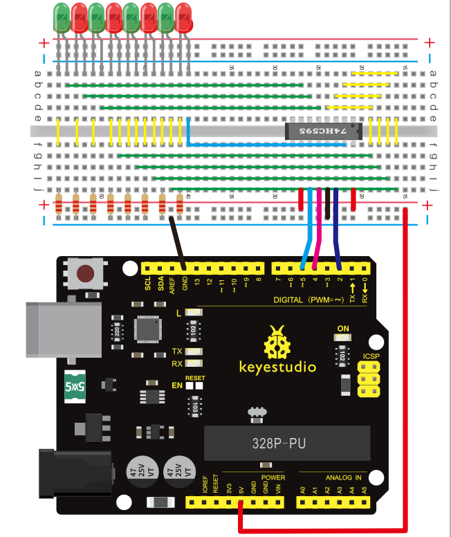

**Connection for 2560 R3:**


The circuit may seem complicated, but once you give it a good look, you will find it easy!

**4）Sample program**

```c
int data = 2;// set pin 14 of 74HC595as data input pin SI 
int clock = 5;// set pin 11 of 74hc595 as clock pin SCK
int latch = 4;// set pin 12 of 74hc595 as output latch RCK 
int ledState = 0;
const int ON = HIGH;
const int OFF = LOW;
void setup()
{
pinMode(data, OUTPUT);
pinMode(clock, OUTPUT);
pinMode(latch, OUTPUT);
}
void loop()
{
for(int i = 0; i < 256; i++)
{
updateLEDs(i);
delay(500);
}
}
void updateLEDs(int value)
{
digitalWrite(latch, LOW);//
shiftOut(data, clock, MSBFIRST, ~value);// serial data “output”, high level first
digitalWrite(latch, HIGH);// latch
}
```


**5）Result**

After downloading the program, you can see 8 LEDs displaying 8-bit binary number.


Project 17: 1-digit LED display

**1）Introduction**

LED segment displays are common for displaying numerical information.

They are widely applied on displays of electromagnetic oven, full automatic washing machine, water temperature display, electronic clock etc.

So it is necessary that we learn how it works.

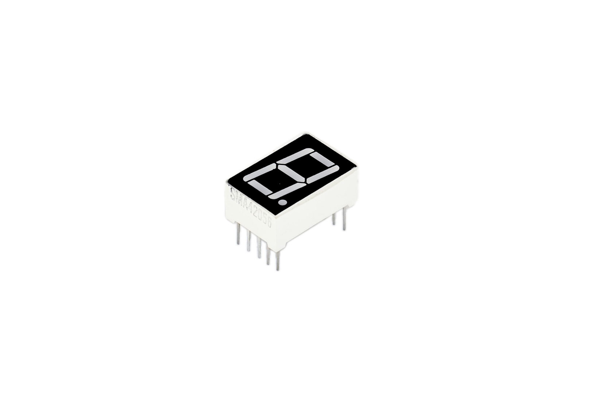

LED segment display is a semiconductor light-emitting device. Its basic unit is a light-emitting diode (LED). LED segment display can be divided into 7-segment display and 8-segment display according to the number of segments. 8-segment display has one more LED unit (for decimal point display) than 7-segment one.

In this experiment, we use a 8-segment display. According to the wiring method of LED units, LED segment displays can be divided into display with common anode and display with common cathode.

Common anode display refers to the one that combine all the anodes of LED units into one common anode (COM).

For the common anode display, connect the common anode (COM) to +5V. When the cathode level of a certain segment is low, the segment is on; when the cathode level of a certain segment is high, the segment is off.

For the common cathode display, connect the common cathode (COM) to GND. When the anode level of a certain segment is high, the segment is on; when the anode level of a certain segment is low, the segment is off.


Each segment of the display consists of an LED. So when you use it, you also need use a current-limiting resistor. Otherwise, LED will be burnt out.

In this experiment, we use a common cathode display. As we mentioned above, for common cathode display, connect the common cathode (COM) to GND.

When the anode level of a certain segment is high, the segment is on; when the anode level of a certain segment is low, the segment is off.

**2）Hardware required**

-   1-digit 8-segment display \*1

-   220Ω resistor \*8

-   Breadboard \*1

-   V4.0 Board or MEGA 2650 Board \*1

-   USB cable \*1

-   Breadboard jumper wire \* 12

**3）Circuit Connection**

**Connection for V4.0:**


**Connection for 2560 R3:**


**4）Sample program**

There are seven segments for numerical display, one for decimal point display. Corresponding segments will be turned on when displaying certain numbers.

For example, when displaying number 1, b and c segments will be turned on. We compile a subprogram for each number, and compile the main program to display one number every 2 seconds, cycling display number 0 \~ 9.

The displaying time for each number is subject to the delay time, the longer the delay time, the longer the displaying time.

**Refer to the sample code below:**

```c
// set the IO pin for each segment
int a=7;// set digital pin 7 for segment a
int b=6;// set digital pin 6 for segment b
int c=5;// set digital pin 5 for segment c
int d=10;// set digital pin 10 for segment d
int e=11;// set digital pin 11 for segment e
int f=8;// set digital pin 8 for segment f
int g=9;// set digital pin 9 for segment g
int dp=4;// set digital pin 4 for segment dp

void digital_0(void) // display number 5
{
unsigned char j;
digitalWrite(a,HIGH);
digitalWrite(b,HIGH);
digitalWrite(c,HIGH);
digitalWrite(d,HIGH);
digitalWrite(e,HIGH);
digitalWrite(f,HIGH);
digitalWrite(g,LOW);
digitalWrite(dp,LOW);
}
void digital_1(void) // display number 1
{
unsigned char j;
digitalWrite(c,HIGH);// set level as “high” for pin 5, turn on segment c
digitalWrite(b,HIGH);// turn on segment b
for(j=7;j<=11;j++)// turn off other segments
digitalWrite(j,LOW);
digitalWrite(dp,LOW);// turn off segment dp
}
void digital_2(void) // display number 2
{
unsigned char j;
digitalWrite(b,HIGH);
digitalWrite(a,HIGH);
for(j=9;j<=11;j++)
digitalWrite(j,HIGH);
digitalWrite(dp,LOW);
digitalWrite(c,LOW);
digitalWrite(f,LOW);
}
void digital_3(void) // display number 3
{
digitalWrite(g,HIGH);
digitalWrite(a,HIGH);
digitalWrite(b,HIGH);
digitalWrite(c,HIGH);
digitalWrite(d,HIGH);

digitalWrite(dp,LOW);
digitalWrite(f,LOW);
digitalWrite(e,LOW);
}
void digital_4(void) // display number 4
{
digitalWrite(c,HIGH);
digitalWrite(b,HIGH);
digitalWrite(f,HIGH);
digitalWrite(g,HIGH);
digitalWrite(dp,LOW);
digitalWrite(a,LOW);
digitalWrite(e,LOW);
digitalWrite(d,LOW);
}
void digital_5(void) // display number 5
{
unsigned char j;
digitalWrite(a,HIGH);
digitalWrite(b, LOW);
digitalWrite(c,HIGH);
digitalWrite(d,HIGH);
digitalWrite(e, LOW);
digitalWrite(f,HIGH);
digitalWrite(g,HIGH);
digitalWrite(dp,LOW);
}
void digital_6(void) // display number 6
{
unsigned char j;
for(j=7;j<=11;j++)
digitalWrite(j,HIGH);
digitalWrite(c,HIGH);
digitalWrite(dp,LOW);
digitalWrite(b,LOW);
}
void digital_7(void) // display number 7
{
unsigned char j;
for(j=5;j<=7;j++)

digitalWrite(j,HIGH);
digitalWrite(dp,LOW);
for(j=8;j<=11;j++)
digitalWrite(j,LOW);
}
void digital_8(void) // display number 8
{
unsigned char j;
for(j=5;j<=11;j++)
digitalWrite(j,HIGH);
digitalWrite(dp,LOW);
}
void digital_9(void) // display number 5
{
unsigned char j;
digitalWrite(a,HIGH);
digitalWrite(b,HIGH);
digitalWrite(c,HIGH);
digitalWrite(d,HIGH);
digitalWrite(e, LOW);
digitalWrite(f,HIGH);
digitalWrite(g,HIGH);
digitalWrite(dp,LOW);
}
void setup()
{
int i;// set variable
for(i=4;i<=11;i++)
pinMode(i,OUTPUT);// set pin 4-11as “output”
}
void loop()
{
while(1)
{
digital_0();// display number 0
delay(1000);// wait for 1s
digital_1();// display number 1
delay(1000);// wait for 1s
digital_2();// display number 2
delay(1000); // wait for 1s

digital_3();// display number 3
delay(1000); // wait for 1s
digital_4();// display number 4
delay(1000); // wait for 1s
digital_5();// display number 5
delay(1000); // wait for 1s
digital_6();// display number 6
delay(1000); // wait for 1s
digital_7();// display number 7
delay(1000); // wait for 1s
digital_8();// display number 8
delay(1000); // wait for 1s
digital_9();// display number 9
delay(1000); // wait for 1s
}
}
```


**5）Result**

LED segment display will show the number from 0 to 9.


Project 18: 4-digit LED display

**1）Introduction**

In this experiment, we use an Arduino to drive a common anode, 4-digit, 7-segment LED display. For LED display, current-limiting resistors are indispensable. There are two wiring methods for Current-limiting resistor.

One is to connect one resistor for each anode, 4 in totals for d1-d4 anode. An advantage for this method is that it requires fewer resistors, only 4. But it cannot maintain consistent brightness.

Another method is to connect one resistor to each pin. It guarantees consistent brightness, but requires more resistors.

In this experiment, we use 8 220Ω resistors (we use 220Ω resistors because no 100Ω resistor available. If you use 100Ω, the displaying will be more brighter).

For 4-digit displays, there are 12 pins in total. When you place the decimal point downward (see below photo position), the pin on the lower left part is referred to 1, the upper left part 12.


**Manual for LED segment display:**

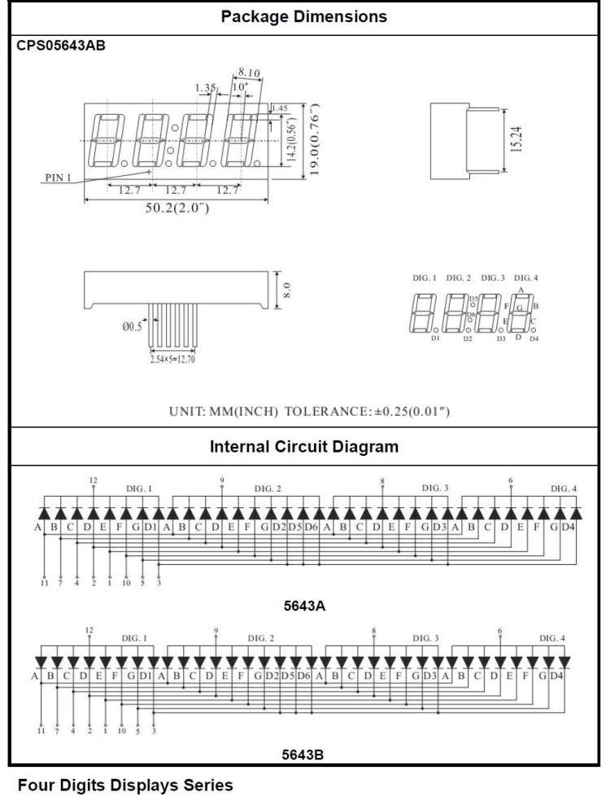

**2）Connection**

**For V4.0**


**For 2560 R3**


**3）Sample program**

```c
// display 1234 
	// select pin for cathode
	int a = 1;
	int b = 2;
	int c = 3;
	int d = 4;
	int e = 5;
	int f = 6;
	int g = 7;
	int dp = 8;
	// select pin for anode
	int d4 = 9;
	int d3 = 10;
	int d2 = 11;
	int d1 = 12;
	// set variable
	long n = 1230;
	int x = 100;
	int del = 55;  // fine adjustment for clock
	 
	void setup()
	{
	  pinMode(d1, OUTPUT);
	  pinMode(d2, OUTPUT);
	  pinMode(d3, OUTPUT);
	  pinMode(d4, OUTPUT);
	  pinMode(a, OUTPUT);
	  pinMode(b, OUTPUT);
	  pinMode(c, OUTPUT);
	  pinMode(d, OUTPUT);
	  pinMode(e, OUTPUT);
	  pinMode(f, OUTPUT);
	  pinMode(g, OUTPUT);
	  pinMode(dp, OUTPUT);
	}
/////////////////////////////////////////////////////////////
void loop()

{
 Display(1, 1);
 Display(2, 2);
 Display(3, 3);
 Display(4, 4);

}
///////////////////////////////////////////////////////////////
void WeiXuan(unsigned char n)//
{
    switch(n)
     {
	case 1: 
	  digitalWrite(d1,LOW);
 	  digitalWrite(d2, HIGH);
	  digitalWrite(d3, HIGH);
	  digitalWrite(d4, HIGH);   
	 break;
	 case 2: 
	  digitalWrite(d1, HIGH);
 	  digitalWrite(d2, LOW);
	  digitalWrite(d3, HIGH);
	  digitalWrite(d4, HIGH); 
	    break;
	  case 3: 
	    digitalWrite(d1,HIGH);
 	   digitalWrite(d2, HIGH);
	   digitalWrite(d3, LOW);
	   digitalWrite(d4, HIGH); 
	    break;
	  case 4: 
	   digitalWrite(d1, HIGH);
 	   digitalWrite(d2, HIGH);
	   digitalWrite(d3, HIGH);
	   digitalWrite(d4, LOW); 
	    break;
        default :
           digitalWrite(d1, HIGH);
	   digitalWrite(d2, HIGH);
	   digitalWrite(d3, HIGH);

	   digitalWrite(d4, HIGH);
        break;
	  }
}
void Num_0()
{
  digitalWrite(a, HIGH);
  digitalWrite(b, HIGH);
  digitalWrite(c, HIGH);
  digitalWrite(d, HIGH);
  digitalWrite(e, HIGH);
  digitalWrite(f, HIGH);
  digitalWrite(g, LOW);
  digitalWrite(dp,LOW);
}
void Num_1()
{
  digitalWrite(a, LOW);
  digitalWrite(b, HIGH);
  digitalWrite(c, HIGH);
  digitalWrite(d, LOW);
  digitalWrite(e, LOW);
  digitalWrite(f, LOW);
  digitalWrite(g, LOW);
  digitalWrite(dp,LOW);
}
void Num_2()
{
  digitalWrite(a, HIGH);
  digitalWrite(b, HIGH);
  digitalWrite(c, LOW);
  digitalWrite(d, HIGH);
  digitalWrite(e, HIGH);
  digitalWrite(f, LOW);
  digitalWrite(g, HIGH);
  digitalWrite(dp,LOW);
}
void Num_3()
{
  digitalWrite(a, HIGH);

  digitalWrite(b, HIGH);
  digitalWrite(c, HIGH);
  digitalWrite(d, HIGH);
  digitalWrite(e, LOW);
  digitalWrite(f, LOW);
  digitalWrite(g, HIGH);
  digitalWrite(dp,LOW);
}
void Num_4()
{
  digitalWrite(a, LOW);
  digitalWrite(b, HIGH);
  digitalWrite(c, HIGH);
  digitalWrite(d, LOW);
  digitalWrite(e, LOW);
  digitalWrite(f, HIGH);
  digitalWrite(g, HIGH);
  digitalWrite(dp,LOW);
}
void Num_5()
{
  digitalWrite(a, HIGH);
  digitalWrite(b, LOW);
  digitalWrite(c, HIGH);
  digitalWrite(d, HIGH);
  digitalWrite(e, LOW);
  digitalWrite(f, HIGH);
  digitalWrite(g, HIGH);
  digitalWrite(dp,LOW);
}
void Num_6()
{
  digitalWrite(a, HIGH);
  digitalWrite(b, LOW);
  digitalWrite(c, HIGH);
  digitalWrite(d, HIGH);
  digitalWrite(e, HIGH);
  digitalWrite(f, HIGH);
  digitalWrite(g, HIGH);
  digitalWrite(dp,LOW);

}
void Num_7()
{
  digitalWrite(a, HIGH);
  digitalWrite(b, HIGH);
  digitalWrite(c, HIGH);
  digitalWrite(d, LOW);
  digitalWrite(e, LOW);
  digitalWrite(f, LOW);
  digitalWrite(g, LOW);
  digitalWrite(dp,LOW);
}
void Num_8()
{
  digitalWrite(a, HIGH);
  digitalWrite(b, HIGH);
  digitalWrite(c, HIGH);
  digitalWrite(d, HIGH);
  digitalWrite(e, HIGH);
  digitalWrite(f, HIGH);
  digitalWrite(g, HIGH);
  digitalWrite(dp,LOW);
}
void Num_9()
{
  digitalWrite(a, HIGH);
  digitalWrite(b, HIGH);
  digitalWrite(c, HIGH);
  digitalWrite(d, HIGH);
  digitalWrite(e, LOW);
  digitalWrite(f, HIGH);
  digitalWrite(g, HIGH);
  digitalWrite(dp,LOW);
}
void Clear()  // clear the screen
{
  digitalWrite(a, LOW);
  digitalWrite(b, LOW);
  digitalWrite(c, LOW);
  digitalWrite(d, LOW);

  digitalWrite(e, LOW);
  digitalWrite(f, LOW);
  digitalWrite(g, LOW);
  digitalWrite(dp,LOW);
}
void pickNumber(unsigned char n)// select number
{
  switch(n)
  {
   case 0:Num_0();
   break;
   case 1:Num_1();
   break;
   case 2:Num_2();
   break;
   case 3:Num_3();
   break;
   case 4:Num_4();
   break;
   case 5:Num_5();
   break;
   case 6:Num_6();
   break;
   case 7:Num_7();
   break;
   case 8:Num_8();
   break;
   case 9:Num_9();
   break;
   default:Clear();
   break; 
  }
}
void Display(unsigned char x, unsigned char Number)//  take x as coordinate and display number
{
  WeiXuan(x);
  pickNumber(Number);
 delay(1);
 Clear() ; // clear the screen
}
```


**4）Result**

Download the above code to the V4.0 Board or MEGA 2650 Board and see the result. The experiment result displays 1234 on the LED display.


Note: if it’s not displaying correctly, check the wiring. Thank you.

Project 19: 8\*8 LED matrix

**1）Introduction**

With low-voltage scanning, LED dot-matrix displays have some advantages such as power saving, long service life, low cost, high brightness, wide angle of view, long visual range, waterproof, and numerous specifications.

LED dot-matrix displays can meet the needs of different applications and thus have a broad development prospect.

This time, we will conduct an LED dot-matrix experiment to experience its charm firsthand.


**2）Hardware required**

-   1 \* V4.0 Board or MEGA 2650 Board

-   1 \* 8x8 dot-matrix

-   8 \* Resistor (220Ω)

-   1 \* Breadboard

-   1 \* USB cable

-   16 \* Jumper wires

**3）Circuit connection**

The external view of a dot-matrix is shown as follows:


**The display principle of the 8\*8 dot-matrix:**

The 8\*8 dot-matrix is made up of sixty-four LEDs, and each LED is placed at the cross point of a row and a column.

When the electrical level of a certain row is 1 and the electrical level of a certain column is 0, the corresponding LED will light up.

If you want to light up the LED on the first dot, you should set pin 9 to high level and pin 13 to low level.

If you want to light LEDs on the first row, you should set pin 9 to high level and pins 13, 3, 4, 10, 6, 11, 15 and 16 to low level.

If you want to light the LEDs on the first column, set pin 13 to low level and pins 9, 14, 8, 12, 1, 7, 2 and 5 to high level.

**Connection diagram**


**Connection for 2560 R3:**


**4）Sample program**

```c
// set an array to store character of “0”
unsigned char Text[]={0x00,0x1c,0x22,0x22,0x22,0x22,0x22,0x1c};
void Draw_point(unsigned char x,unsigned char y)// point drawing function
{ clear_();
   digitalWrite(x+2, HIGH);
   digitalWrite(y+10, LOW);
   delay(1);
}
void show_num(void)// display function, call point drawing function
{
  unsigned char i,j,data;
  for(i=0;i<8;i++)
  {
    data=Text[i];
    for(j=0;j<8;j++)
    {
      if(data & 0x01)Draw_point(j,i);
      data>>=1;

    }  
  }
}
void setup(){ 
int i = 0 ; 
for(i=2;i<18;i++) 
 { 
   pinMode(i, OUTPUT); 
  }  
  clear_(); 
}
void loop()
{ show_num();    
} 
void clear_(void)// clear screen
{for(int i=2;i<10;i++)
  digitalWrite(i, LOW);
  for(int i=0;i<8;i++)
  digitalWrite(i+10, HIGH);
}
```


**5）Test Result**

Burn well the program into V4.0 Board or MEGA 2650 Board, the dot-matrix will display 0.


Note: if it’s not displaying correctly, check the wiring.

Thank you.

Project 20: 1602 LCD


**1）Introduction**

In this experiment, we use an Arduino to drive the 1602 LCD. 1602 LCD has wide applications. At the beginning, 1602 LCD uses a HD44780 controller. Now, almost all 1602 LCD module uses a compatible IC, so their features are basically the same.

2）**1602 LCD parameters:**

-   Display capacity: 16 × 2 characters

-   Chip operating voltage: 4.5 \~ 5.5V

-   Working current: 2.0mA (5.0V)

-   Optimum working voltage of the module is 5.0V

-   Character size: 2.95 \* 4.35 (W \* H) mm

**3）Pins of 1602 LCD:**

| **No.** | **Mark** | **Pin description**      | **No.** | **Mark** | **Pin description**       |
|---------|----------|--------------------------|---------|----------|---------------------------|
| 1       | VSS      | Power GND                | 9       | D2       | Date I/O                  |
| 2       | VDD      | Power positive           | 10      | D3       | Date I/O                  |
| 3       | VL       | LCD voltage bias signal  | 11      | D4       | Date I/O                  |
| 4       | RS       | Select data/command(V/L) | 12      | D5       | Date I/O                  |
| 5       | R/W      | Select read/write(H/L)   | 13      | D6       | Date I/O                  |
| 6       | E        | Enable signal            | 14      | D7       | Date I/O                  |
| 7       | D0       | Date I/O                 | 15      | BLA      | Back light power positive |
| 8       | D1       | Date I/O                 | 16      | BLK      | Back light power negative |


**Interface description:**

1.  Two power pins, one for module power, another one for back light, generally use 5V. In this project, we use 3.3V for backlight.
    
2.  **VL** is the pin for adjusting contrast ratio. It usually connects a potentiometer(no more than 5KΩ) in series for its adjustment.

In this experiment, we use a 1KΩ resistor. For its connection, it has two methods, namely high potential and low potential. Here, we use low potential method; connect the resistor and then the GND.

1.  **RS** is a very common pin in LCD. It's a selecting pin for command/data. When the pin is in high level, it's in data mode; when it's in low level, it's in command mode.
    
2.  **RW** pin is also very common in LCD. It's a selecting pin for read/write.

When the pin is in high level, it's in read operation; if in low level, it's in write operation.

1.  **E** pin is also very common in LCD. Usually, when the signal in the bus is stabilized, it sends out a positive pulse requiring read operation. When this pin is in high level, the bus is not allowed to have any change.
    
2.  **D0-D7** is 8-bit bidirectional parallel bus, used for command and data transmission.
    
3.  **BLA** is anode for back light; **BLK**, cathode for back light.

**Basic operations of 1602LCD:**

| **Read status** | **input** | **RS=L, R/W=H, E=H**                          | **output** | **D0-D7=status word** |
|-----------------|-----------|-----------------------------------------------|------------|-----------------------|
| Write command   | input     | RS=L, R/W=H, D0-D7=command code, E=high pulse | output     | none                  |
| Read data       | input     | RS=H, R/W=H, E=H                              | output     | D0-D7=data            |
| Write data      | input     | RS=H, R/W=L, D0-D7=data, E=high pulse         | output     | none                  |

**4）Hardware required**

-   1 \* V4.0 Board or MEGA 2650 Board

-   1 \* 1602 LCD

-   1 \* Breadboard

-   1 \* potentiometer

-   1 \* USB cable

-   16\*Jumper wires

**5）Connection A**

1602 can directly communicate with Arduino. It has two connection methods, namely 8-bit connection and 4-bit connection.

**8-bit connection method:**


**Connection for V4.0:**


**Connection for 2560 R3:**


**6）Sample code** A

```c
int DI = 12;
int RW = 11;
int DB[] = {3, 4, 5, 6, 7, 8, 9, 10};// use array to select pin for bus
int Enable = 2;

void LcdCommandWrite(int value) {
// define all pins
int i = 0;
for (i=DB[0]; i <= DI; i++) // assign value for bus
{
   digitalWrite(i,value & 01);// for 1602 LCD, it uses D7-D0( not D0-D7) for signal identification; here, it’s used for signal inversion. 
   value >>= 1;
}
digitalWrite(Enable,LOW);
delayMicroseconds(1);
digitalWrite(Enable,HIGH);
delayMicroseconds(1);  // wait for 1ms
digitalWrite(Enable,LOW);
delayMicroseconds(1);  // wait for 1ms
}

void LcdDataWrite(int value) {
// initialize all pins
int i = 0;
digitalWrite(DI, HIGH);
digitalWrite(RW, LOW);
for (i=DB[0]; i <= DB[7]; i++) {
   digitalWrite(i,value & 01);
   value >>= 1;
}
digitalWrite(Enable,LOW);
delayMicroseconds(1);
digitalWrite(Enable,HIGH);
delayMicroseconds(1);
digitalWrite(Enable,LOW);
delayMicroseconds(1);  // wait for 1ms
}

void setup (void) {
int i = 0;
for (i=Enable; i <= DI; i++) {
   pinMode(i,OUTPUT);
}
delay(100);
// initialize LCD after a brief pause
// for LCD control
LcdCommandWrite(0x38);  // select as 8-bit interface, 2-line display, 5x7 character size 
delay(64);                      
LcdCommandWrite(0x38);  // select as 8-bit interface, 2-line display, 5x7 character size 
delay(50);                      
LcdCommandWrite(0x38);  // select as 8-bit interface, 2-line display, 5x7 character size             
delay(20);                      
LcdCommandWrite(0x06);  // set input mode
                         // auto-increment, no display of shifting
delay(20);                      
LcdCommandWrite(0x0E);  // display setup
                         // turn on the monitor, cursor on, no flickering
delay(20);                      
LcdCommandWrite(0x01);  // clear the scree, cursor position returns to 0
delay(100);                      
LcdCommandWrite(0x80);  //  display setup
                         //  turn on the monitor, cursor on, no flickering

delay(20);                      
}

void loop (void) {
  LcdCommandWrite(0x01);  // clear the scree, cursor position returns to 0  
  delay(10); 
  LcdCommandWrite(0x80+3); 
  delay(10);                     
  // write in welcome message 
  LcdDataWrite('W');
  LcdDataWrite('e');
  LcdDataWrite('l');
  LcdDataWrite('c');
  LcdDataWrite('o');
  LcdDataWrite('m');
  LcdDataWrite('e');
  LcdDataWrite(' ');
  LcdDataWrite('t');
  LcdDataWrite('o');
  delay(10);
  LcdCommandWrite(0xc0+1);  // set cursor position at second line, second position
  delay(10); 
  LcdDataWrite('k');
  LcdDataWrite('e');
  LcdDataWrite('y');
  LcdDataWrite('e');
  LcdDataWrite('s');
  LcdDataWrite('t');
  LcdDataWrite('u');
  LcdDataWrite('d');
  LcdDataWrite('i');
  LcdDataWrite('o');
  delay(5000);
  LcdCommandWrite(0x01);  // clear the screen, cursor returns to 0  
  delay(10);
  LcdDataWrite('I');
  LcdDataWrite(' ');
  LcdDataWrite('a');
  LcdDataWrite('m');
  LcdDataWrite(' ');
  LcdDataWrite('h');
  LcdDataWrite('u');
  LcdDataWrite('n');
  LcdDataWrite('t');
  LcdDataWrite('e');
  LcdDataWrite('r');
  delay(3000);
  LcdCommandWrite(0x02); // set mode as new characters replay old ones, where there is no new ones remain the same
  delay(10);
  LcdCommandWrite(0x80+5); // set cursor position at first line, sixth position
  delay(10);  
  LcdDataWrite('t');
  LcdDataWrite('h');
  LcdDataWrite('e');
  LcdDataWrite(' ');
  LcdDataWrite('w');
  LcdDataWrite('o');
  LcdDataWrite('r');
  LcdDataWrite('l');
  LcdDataWrite('d');
  delay(5000);
}
```

7）Connection B

****

Note: if it’s not displaying correctly, check the wiring.

**bit connection method**

When using this module, 8-bit connection uses all the digital pins of the Arduino, leaving no pin for sensors. What then? We can use 4-bit connection.


**Connection for V4.0:** 


**Connection for 2560 R3:**


After the connection, upload below code to the V4.0 Board or MEGA 2650 Board and see how it goes.

**8）Sample code B**

```c
/* LCD RS pin to digital pin 12
 * LCD Enable pin to digital pin 11
 * LCD D4 pin to digital pin 9
 * LCD D5 pin to digital pin 8
 * LCD D6 pin to digital pin 7
 * LCD D7 pin to digital pin 6
 * LCD R/W pin to ground
 * LCD VSS pin to ground
 * LCD VCC pin to 5V
 * 10K resistor
 * ends to +5V and ground
 * wiper to LCD VO pin (pin 3)
 This example code is in the public domain.
 http//www.arduino.cc/en/Tutorial/LiquidCrystal
 */
// include the library code
#include <LiquidCrystal.h>
// initialize the library with the numbers of the interface pins
LiquidCrystal lcd(12, 11, 9, 8, 7, 6);
void setup() {
  // set up the LCD's number of columns and rows
  lcd.begin(16, 2);
  // Print a message to the LCD.
  lcd.print("hello, world!");
}
void loop() {
  // set the cursor to column 0, line 1
  // (note line 1 is the second row, since counting begins with 0)
  lcd.setCursor(0, 1);
  // print the number of seconds since reset
  lcd.print(millis() / 1000);
}
```


Project 21: Servo Control

**1）Introduction**

Servo motor is a position control rotary actuator. It mainly consists of housing, circuit board, core-less motor, gear and position sensor.

**2）Working principle**

The receiver or MCU outputs a signal to the servo motor. The motor has a built-in reference circuit that gives out reference signal, cycle of 20ms and width of 1.5ms. The motor compares the acquired DC bias voltage to the voltage of the potentiometer and outputs a voltage difference.

The IC on the circuit board will decide the rotating direction accordingly and drive the core-less motor. The gear then pass the force to the shaft. The sensor will determine if it has reached the commanded position according to the feedback signal.

Servomotors are used in control systems that requires to have and maintain different angles. When the motor speed is definite, the gear will cause the potentiometer to rotate. When the voltage difference reduces to zero, the motor stops. Normally, the rotation angle range is among 0-90 degrees.


Servomotor comes with many specifications. But all of them have three connection wires, distinguished by brown, red, orange colors (different brand may have different color). Brown one is for GND, red one for power positive, orange one for signal line.


The rotation angle of the servo motor is controlled by regulating the duty cycle of the PWM(Pulse-Width Modulation) signal.

The standard cycle of the PWM signal is fixed at 20ms (50 Hz), and the pulse width is distributed between 1ms-2ms. The width corresponds the rotation angle from 0° to 90°.

But note that for different brand motor, the same signal may have different rotation angle.


After some basic knowledge, let's learn how to control a servomotor.

In this experiment, you only need a servomotor and several jumper wires.

**3）Hardware required**

-   Servo motor\*1

-   Breadboard jumper wire\* 3

**4）Connection**

There are two ways to control a servomotor with Arduino. One is to use a common digital sensor port of Arduino to produce square wave with different duty cycle to simulate PWM signal and use that signal to control the position of the motor.

Another way is to directly use the Servo function of the Arduino to control the motor. In this way, the program will be easier but it can only control two-contact motor because of the servo function, only digital pin 9 and 10 can be used.

The Arduino drive capacity is limited. So if you need to control more than one motor, you will need external power.

**Connection for V4.0:**


**Connection for 2560 R3:**


Connect the signal line of motor to digital pin 9. Compile a program to control the motor to rotate to the commanded angle, and display the angle on the monitor.

**5）Sample program A**

```c
int servopin=9;// select digital pin 9 for servomotor signal line
int myangle;// initialize angle variable
int pulsewidth;// initialize width variable
int val;
void servopulse(int servopin,int myangle)// define a servo pulse function
{
pulsewidth=(myangle*11)+500;// convert angle to 500-2480 pulse width
digitalWrite(servopin,HIGH);// set the level of servo pin as “high”
delayMicroseconds(pulsewidth);// delay microsecond of pulse width
digitalWrite(servopin,LOW);// set the level of servo pin as “low”
delay(20-pulsewidth/1000);
}

void setup()
{
pinMode(servopin,OUTPUT);// set servo pin as “output”
Serial.begin(9600);// connect to serial port, set baud rate at “9600”
Serial.println("servo=o_seral_simple ready" ) ;
}
void loop()// convert number 0 to 9 to corresponding 0-180 degree angle, LED blinks corresponding number of time
{
val=Serial.read();// read serial port value
if(val>='0'&&val<='9')
{
val=val-'0';// convert characteristic quantity to numerical variable
val=val*(180/9);// convert number to angle
Serial.print("moving servo to ");
Serial.print(val,DEC);
Serial.println();
for(int i=0;i<=50;i++) // giving the servo time to rotate to commanded position
{
servopulse(servopin,val);// use the pulse function
}
}
}
```

**6）Sample program B**

Let's first take a look at the Arduino built-in servo function and some of its common statements.

1\. **attach（interface）**——select pin for servo, can only use pin 9 or 10.

2\. **write（angle）**——used to control the rotation angle of the servo, can set the angle among 0 degree to 180 degree.

3\. **read（）**——used to read the angle of the servo, consider it a function to read the value in the write() function.

4\. **attached（）**——determine whether the parameter of the servo is sent to the servo pin.

5\. **detach（）**—— disconnect the servo and the pin, and the pin(digital pin 9 or 10) can be used for PWM port.

**Note:** the written form of the above statements are **"servo variable name. specific statement ()"**, e.g. myservo. Attach (9).

Still, connect the signal line of servo to pin 9. Please refer to the connection diagram mentioned above.

Please remember to place the **Servo.h** library into your arduino libraries directory.

```c
#include <Servo.h>
/*define a header file. Special attention here, you can call the servo function directly from Arduino's software menu bar Sketch>Importlibrary>Servo, or input  #include <Servo.h>. Make sure there is a space between #include and  <Servo.h>. Otherwise, it will cause compile error. */
Servo myservo;// define servo variable name
void setup()
{
myservo.attach(9);// select servo pin(9 or 10)
}
void loop()
{
myservo.write(90);// set rotation angle of the motor
}
```

Above are the two methods to control the servo. You can choose either one according to your liking or actual need.


Project 22: L293D Driving Motor


**1）Introduction**

In this project, we use L293D chip to build a circuit that can drive the motor rotate.


**L293D Chip Pins:**

-   **1 ENABLE1**：used for the left IC control. When the pin is high voltage, left IC works; otherwise, if it is low voltage, not work.
    
-   \*\*2 INPUT1*\* when the pin is High voltage, current flows out to OUTPUT 1.
    
-   **3 OUTPUT1**：connect to a pin of motor terminal

-   \*\*4,5 GND：\*\*ground

-   **6 OUTPUT 2**：connect to a pin of motor terminal

-   **7 INPUT2**：when the pin is High voltage, current flows out to OUTPUT 2.

-   \*\*8 VS：\*\* the motor driving voltage, the range of DC 5-36V, recommended DC 12V.
    
-   **9 ENABLE2**：used for the right IC control. When the pin is high voltage, right IC works; otherwise, if it is low voltage, not work.
    
-   \*\*10 INPUT 3：\*\* when the pin is High voltage, current flows out to OUTPUT 3.
    
-   **11 OUTPUT 3**：connect to a pin of motor terminal

-   **12,13 GND**：ground

-   **14 OUTPUT 4**：connect to a pin of motor terminal

-   \*\*15 INPUT 4：\*\*when the pin is High voltage, current flows out to OUTPUT 4.
    
-   \*\*16 VSS：\*\*power for IC, supply this Pin with 5V.

**2）Hardware required**

-   DC motor \*1

-   Motor fan\*1

-   L293D chip \*1

-   V4.0 Board or MEGA 2650 Board \*1

-   USB cable \*1

-   Breadboard jumper wire \* 12

**3）Connection diagram**

You can follow the diagram below to build the circuit.

**Connection for V4.0:**


**Connection for 2560 R3:**


**4）Sample Code**

```c
int IN1=7;
int IN2=6;
int ENA=5;
void setup()
{
 for (int i = 5; i <8; i ++) 
   {
     pinMode(i, OUTPUT);   
   }
}
void loop()
{
   //turn forward
  digitalWrite(IN1,LOW);
  digitalWrite(IN2,HIGH);
  analogWrite(ENA,200); 
  delay(1000);
  //delay one second
  analogWrite(ENA,0); 
  delay(1000); 
  //turn forward
  digitalWrite(IN1,HIGH);
  digitalWrite(IN2,LOW);
  analogWrite(ENA,100); 
  delay(1000);
  //pause one second
  analogWrite(ENA,0); 
  delay(1000); 
}
```


**5）Test result**

Done uploading the code, you can see the motor rotate forward for one second, stop for one second, reverse for one second and stop for one second, repeatedly.

ENA is connected to PWM pins of UNO. You can control the PWM to control the speed of motor. In the experiment, the speed of rotation forward is obviously faster than reverse speed.


Project 23: PIR Motion Sensing

**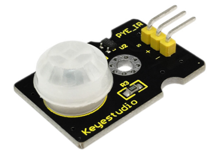**

**1）Description**

Pyroelectric infrared motion sensor can detect infrared signals from a moving person or moving animal, and output switching signals.

It can be applied to a variety of occasions to detect the movement of human body.

Conventional pyroelectric infrared sensors require body pyroelectric infrared detector, professional chip and complex peripheral circuit, so the size is much more bigger, with complex circuit and lower reliability.

Now we launch this new pyroelectric infrared motion sensor, specially designed for Arduino. It uses an integrated digital body pyroelectric infrared sensor, with smaller size, higher reliability, lower power consumption and simpler peripheral circuit.

**2）Specifications**

-   Input Voltage: 3.3 \~ 5V, Maximum for 6V

-   Working Current: 15uA

-   Working Temperature: -20 \~ 85 ℃

-   Output Voltage: High 3V, Low 0V

-   Output Delay Time (High Level): About 2.3 to 3 Seconds

-   Detection Angle: 100 °

-   Detection Distance: 7 meters

-   Output Indicator LED (if output HIGH, it will be ON)

-   Limit Current for Pin: 100mA

**3）Connection Diagram**

First, you need to prepare the following parts before connection:

-   V4.0 Board or MEGA 2650 Board\*1

-   PIR motion sensor\*1

-   USB Cable\*1

-   Jumper Wire\*3

Connect the S pin of module to Digital 3 of V4.0 Board or MEGA 2650 Board, connect the negative pin to GND port, positive pin to 5V port.


**Connection for 2560 R3:**


**4）Sample Code**

Copy and paste the below code to Arduino software.

```c
byte sensorPin = 3;
byte indicator = 13;
void setup()
{
  pinMode(sensorPin,INPUT);
  pinMode(indicator,OUTPUT);
  Serial.begin(9600);
}
void loop()
{
  byte state = digitalRead(sensorPin);
  digitalWrite(indicator,state);
  if(state == 1)Serial.println("Somebody is in this area!");
  else if(state == 0)Serial.println("No one!");
  delay(500);
}
```


**5）Example Result**

Done wiring and powered up, upload well the code.

If the sensor detects someone moving nearby, D13 indicator on V4.0 Board or MEGA 2650 Board will light up, and "Somebody is in this area!" is displayed on the serial monitor of Arudino software.

If no detecting the movement, D13 indicator on V4.0 Board or MEGA 2650 Board will be off, and "No one!" is displayed on the serial monitor.


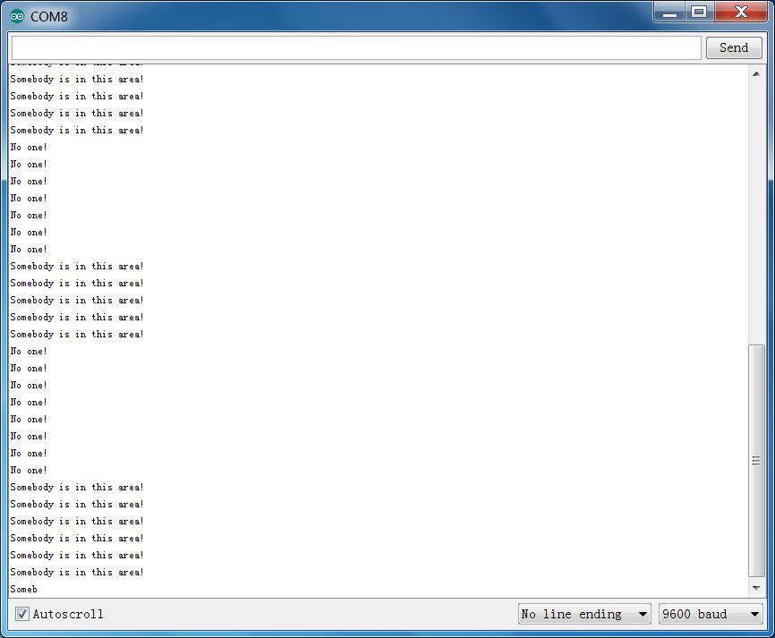

Project 24: Temperature and Humidity


**1）Introduction**

This DHT11 sensor features calibrated digital signal output with the temperature and humidity sensor complex. Its technology ensures high reliability and excellent long-term stability.

This sensor includes a resistive element and a sense of wet NTC temperature measuring devices. It has advantages of excellent quality, fast response, anti-interference ability and high cost performance.

Each DHT11 sensor features extremely accurate calibration data of humidity calibration chamber. The calibration coefficients stored in the OTP program memory, internal sensors detect signals in the process, and we should call these calibration coefficients.

The single-wire serial interface system is integrated to make it quick and easy. Qualities of small size, low power, and 20-meter signal transmission distance make it a wide applied application or even the most demanding one.

**2）Specification**

-   Supply Voltage: +5 V

-   Temperature range: 0-50 °C error of ± 2 °C

-   Humidity: 20-90% RH ± 5% RH error

-   Interface: Digital

**3）Connection Diagram**

Firstly you need to prepare the following parts before testing.

-   V4.0 Board or MEGA 2650 Board\*1

-   DHT11 sensor\*1

-   USB Cable\*1

-   Jumper Wire\*3

Then follow the wiring diagram, connect the Signal pin of sensor to Digital 4 port of V4.0 Board or MEGA 2650 Board, negative pin to GND port, positive pin to 5V port.


**Connection for 2560 R3:**


**4）Sample Code**

Please remember to place the [**DHT11 Lib**](https://github.com/RobTillaart/Arduino/tree/master/libraries/DHTlib) into your arduino libraries directory.

Copy and paste the code below to Arduino software.

```c
#include <dht11.h>
dht11 DHT;
#define DHT11_PIN 4
  
void setup(){
  Serial.begin(9600);
  Serial.println("DHT TEST PROGRAM ");
  Serial.print("LIBRARY VERSION: ");
  Serial.println(DHT11LIB_VERSION);
  Serial.println();
  Serial.println("Type,\tstatus,\tHumidity (%),\tTemperature (C)");
}
  
void loop(){
  int chk;
  Serial.print("DHT11, \t");
  chk = DHT.read(DHT11_PIN);    // READ DATA
  switch (chk){
    case DHTLIB_OK:  
                Serial.print("OK,\t"); 
                break;

case DHTLIB_ERROR_CHECKSUM: 

                Serial.print("Checksum error,\t"); 
                break;
    case DHTLIB_ERROR_TIMEOUT: 
                Serial.print("Time out error,\t"); 
                break;
    default: 
                Serial.print("Unknown error,\t"); 
                break;
  }
 // DISPLAT DATA
  Serial.print(DHT.humidity,1);
  Serial.print(",\t");
  Serial.println(DHT.temperature,1);
  
  delay(1000);
}
```


**5）Example Result**

Wire it up well and upload the above code to V4.0 Board or MEGA 2650 Board. Then open the serial monitor and set the baud rate to 9600, finally you will see the current temperature and humidity value.


Project 25: Relay

**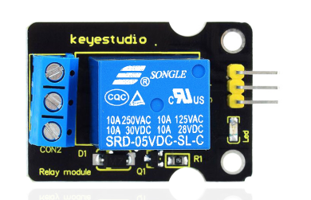**

**1）Introduction**

This single relay module can be used in interactive projects. This module uses SONGLE 5v high-quality relay. It can also be used to control lighting, electrical and other equipment.

The modular design makes it easy to expand withV4.0 Board or MEGA 2650 Board\*1. The relay output is by a light-emitting diode. It can be controlled through digital IO port, such as solenoid valves, lamps, motors and other high current or high voltage devices.

**2）Specification**

-   Type: Digital

-   Rated current: 10A (NO) 5A (NC)

-   Maximum switching voltage: 150VAC 24VDC

-   Digital interface

-   Control signal: TTL level

-   Rated load: 8A 150VAC (NO), 10A 24VDC (NO), 5A 250VAC (NO/NC), 5A 24VDC
    (NO/NC)

-   Maximum switching power: AC1200VA DC240W (NO), AC625VA DC120W (NC)

-   Contact action time: 10ms

**3）Connection Diagram**

Firstly you need to prepare the following parts before connection.

-   V4.0 Board or MEGA 2650 Board\*1

-   Relay module\*1

-   LED \*1

-   Breadboard \*1

-   USB Cable\*1

-   Jumper Wire\*9

Here we use the single relay module to control an LED module on or off. So first connect well all the components as the below diagram shown.

For relay module, connect the Signal pin to Digital port 8 of V4.0 Board or MEGA 2650 Board, then connect its positive pin to anode row of breadboard, lead off the row to 5V port of V4.0 Board or MEGA 2650 Board. Connect its negative pin to cathode row of breadboard, lead off the row to GND port.

For LED module, connect its Signal pin to one terminal block of relay module, another terminal block on the relay is connected to Digital port 13 of V4.0 Board or MEGA 2650 Board. Connect its positive pin to anode row, negative pin to cathode row of breadboard.

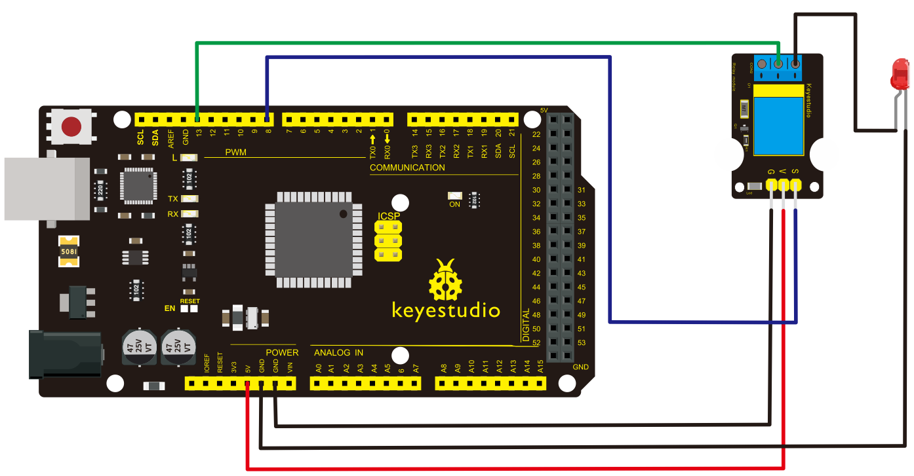

**4）Sample Code**

Copy and paste the code below to Arduino software.

```c
 int Relay = 8;
  void setup()
{
  pinMode(13, OUTPUT);         //Set Pin13 as output
  digitalWrite(13, HIGH);     //Set Pin13 High
  pinMode(Relay, OUTPUT);     //Set Pin3 as output
}
void loop()
{
          digitalWrite(Relay, HIGH);   //Turn off relay
          delay(2000);
          digitalWrite(Relay, LOW);    //Turn on relay
          delay(2000);
}
```


**5）Example Result**


This relay module is active HIGH level. Wire it up well, powered up, then upload the above code to the board, you will see the relay is turned on（ON connected, NC disconnected）for two seconds, then turned off for two seconds（NC closed,ON disconnected）, repeatedly and circularly.

When the relay is turned on, external LED is on. If relay is turned off, external LED is off.

Project 26: Ultrasonic Ranger


**1）Description**

As the ultrasonic has strong directivity, slow energy consumption and far spread distance in the media, so it is commonly used in the measurement of distance, such as range finder and position measuring instrument.

Using ultrasonic is more rapid, convenient, simple to calculate and more easier to achieve real-time control, so it has also been widely used in the development of mobile robots.

Ultrasonic detector module can provide 2cm-450cm non-contact sensing distance, and its ranging accuracy is up to 3mm, very good to meet the normal requirements. The module includes an ultrasonic transmitter and receiver as well as the corresponding control circuit.

**2）Working Schematics**

Please refer to the working [sequence](D:/Dict/7.3.0.0807/resultui/dict/javascript:;) as below：


1\. First pull down the TRIG, and then trigger it with at least 10us high level signal;

2\. After triggering, the module will automatically transmit eight 40KHZ square waves, and automatically detect whether there is a signal to return.

3\. If there is a signal returned back, through the ECHO to output a high level, the duration time of high level is actually the time from emission to reception of ultrasonic.

Test distance = high level duration \* 340m/s \* 0.5.

**3）Parameters**

-   Working voltage：0.5V(DC)

-   Working current：15mA

-   Detecting range：2-450cm

-   Detecting angle：15 degrees

-   Input trigger pulse：10us TTL Level

-   Output echo signal：output TTL level signal (HIGH)，proportional to range.

**4）PINOUT Diagram**


**5）Connection Diagram**

First, you need to prepare the following components:

-   V4.0 Board or MEGA 2650 Board\*1

-   Ultrasonic sensor\*1

-   USB Cable\*1

-   Jumper wire\*4

Next, please refer to the following connection table:


Note: D4、D5 are the digital pin 4 and pin 5.


**Connection for 2560 R3:**


After connecting well, you can use them to measure the distance, displaying the distance value on the monitor.

**6）Test Code**

Finally, copy and paste the test code below to Arduino software

```c
int inputPin=4; // define ultrasonic signal receiver pin ECHO to D4 
int outputPin=5; // define ultrasonic signal transmitter pin TRIG to D5
 void setup()
{
Serial.begin(9600); 
pinMode(inputPin, INPUT); 
pinMode(outputPin, OUTPUT);
}
void loop()
{
digitalWrite(outputPin, LOW); delayMicroseconds(2);

digitalWrite(outputPin, HIGH); // Pulse for 10μ s to trigger ultrasonic detection

delayMicroseconds(10); 
digitalWrite(outputPin, LOW);

int distance = pulseIn(inputPin, HIGH); // Read receiver pulse time 
distance= distance/58; // Transform pulse time to distance 
Serial.println(distance); //Output distance
delay(50);
}
```


**7）Example Result**

After upload well the code to V4.0 Board or MEGA 2650 Board, then open the serial monitor. When place an object in front of the ultrasonic sensor (from near and far), it will detect the distance of object. The value will be displayed on the monitor.


## 6.Resources Download

[https//fs.keyestudio.com/KS0402-0404](https//fs.keyestudio.com/KS0402-0404)


